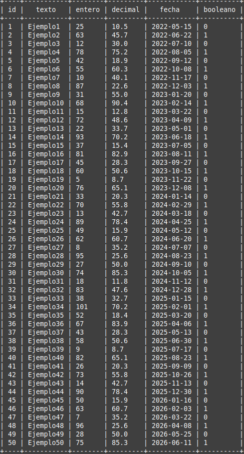
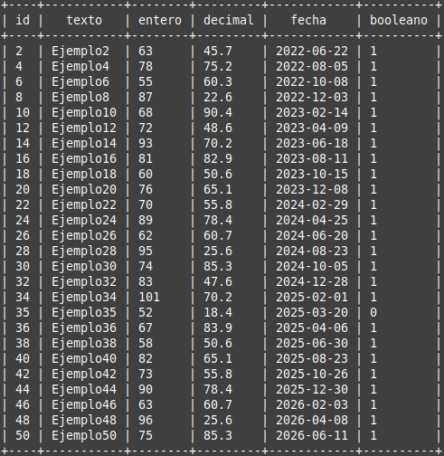
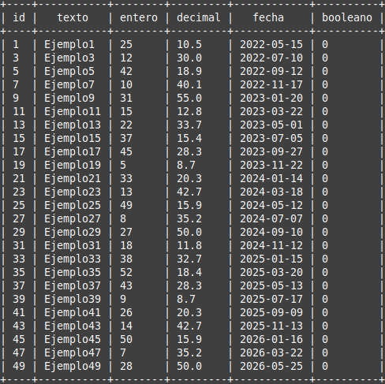
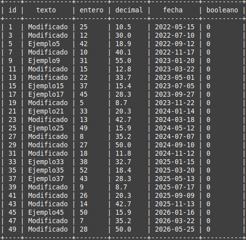
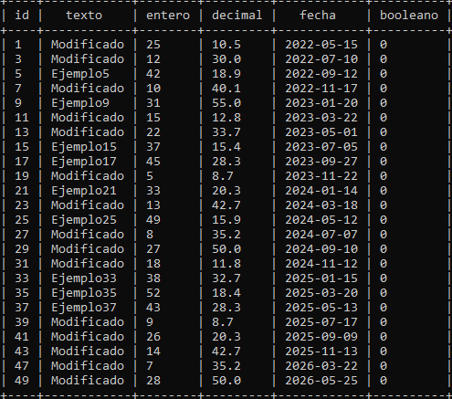
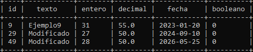
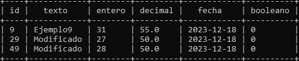

# Creación de DB

## Creación de tabla
```sql
create table Ejemplo
(id INTEGER primary key not null,
texto TEXT not null,
entero integer not null,
decimal real not null,
fecha date not null,
booleano boolean not null);

```
---
## Inserción de datos
```sql
insert into Ejemplo (texto,entero,decimal,fecha,booleano) values ('Ejemplo1',25,10.5,2022-05-15,0);
insert into Ejemplo (texto,entero,decimal,fecha,booleano) values ('Ejemplo1',25,10.5,2022-05-15,0);
insert into Ejemplo (texto,entero,decimal,fecha,booleano) values ('Ejemplo49',28,50.0,'2026-05-25',0);
insert into Ejemplo (texto,entero,decimal,fecha,booleano) values ('Ejemplo50',75,85.3,'2026-06-11',1);
```

---

## Realizar consultas

```sql
select * from Ejemplo;
```


```sql
select * from Ejemplo where entero>50;
```


```sql
delete from Ejemplo where booleano=1;
```



```sql
update Ejemplo set texto='Modificado' where entero<30;
```



```sql
delete from Ejemplo where entero=50;
```



```sql
delete from Ejemplo where decimal<50;
```



```sql
update Ejemplo set fecha=date('now');
```


