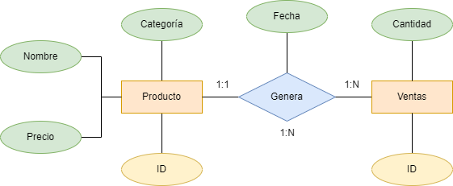
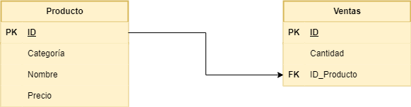

## Responde a las siguientes cuestiones

**Realiza el diagrama ER de la BBDD supermercado.**


<br>
<br>

**Realiza el diagrama MR de la BBDD supermercado.**



<br>
<br>

**Indica si la BBDD esta normalizada hasta la 3ª forma normal, justificando la respuesta.**

Las tablas está en La Primera Forma Normal (1FN) puesto que no existen propiedades multievaluadas ni compuestas en estas.

La Segunda Forma Normal (2FN) también se cumple puesto que se cumple la 1FN y todos los atributos que no son parte de la clave primaria tienen dependecia funcional de ella.

Por último La Tercera Forma Normal (3FN) no se cumple porque, si bien se cumple la 2FN, existen dependencias transitivas en la tabla como en el caso de categoría.
```code
┌────┬─────────────┬──────────┬────────────┐
│ id │ id_producto │ cantidad │   fecha    │
├────┼─────────────┼──────────┼────────────┤
│ 1  │ 1           │ 5        │ 2024-01-17 │
│ 2  │ 2           │ 3        │ 2024-01-17 │
│ 3  │ 4           │ 2        │ 2024-01-17 │
│ 4  │ 5           │ 1        │ 2024-01-17 │
│ 5  │ 6           │ 10       │ 2024-01-18 │
│ 6  │ 8           │ 4        │ 2024-01-18 │
│ 7  │ 10          │ 2        │ 2024-01-18 │
│ 8  │ 14          │ 7        │ 2024-01-19 │
│ 9  │ 16          │ 3        │ 2024-01-19 │
│ 10 │ 18          │ 6        │ 2024-01-20 │
└────┴─────────────┴──────────┴────────────┘
┌────┬────────────────────┬───────────┬────────┐
│ id │       nombre       │ categoria │ precio │
├────┼────────────────────┼───────────┼────────┤
│ 1  │ Arroz              │ Alimentos │ 2.5    │
│ 2  │ Leche              │ Lácteos   │ 1.8    │
│ 3  │ Pan                │ Panadería │ 1.2    │
│ 4  │ Manzanas           │ Frutas    │ 3.0    │
│ 5  │ Pollo              │ Carnes    │ 5.5    │
│ 6  │ Huevos             │ Lácteos   │ 1.0    │
│ 7  │ Yogurt             │ Lácteos   │ 2.0    │
│ 8  │ Tomates            │ Verduras  │ 2.2    │
│ 9  │ Queso              │ Lácteos   │ 4.0    │
│ 10 │ Cereal             │ Desayuno  │ 3.5    │
│ 11 │ Papel Higiénico    │ Hogar     │ 1.5    │
│ 12 │ Cepillo de Dientes │ Higiene   │ 2.0    │
│ 13 │ Detergente         │ Limpieza  │ 2.8    │
│ 14 │ Galletas           │ Snacks    │ 1.7    │
│ 15 │ Aceite de Oliva    │ Cocina    │ 4.5    │
│ 16 │ Café               │ Bebidas   │ 5.0    │
│ 17 │ Sopa enlatada      │ Conservas │ 2.3    │
│ 18 │ Jabón de Baño      │ Higiene   │ 1.2    │
│ 19 │ Botellas de Agua   │ Bebidas   │ 1.0    │
│ 20 │ Cerveza            │ Bebidas   │ 3.8    │
└────┴────────────────────┴───────────┴────────┘
```
## Realiza las siguientes consultas, y muestra el resultado obtenido:

**Mostrar todos los productos de la categoría "Bebidas".**
```sql
select nombre from productos where categoria='Bebidas';
┌──────────────────┐
│      nombre      │
├──────────────────┤
│ Café             │
│ Botellas de Agua │
│ Cerveza          │
└──────────────────┘
```

**Listar los productos ordenados por precio de forma descendente.**
```sql
select nombre, precio FROM productos order by precio desc;
┌────────────────────┬────────┐
│       nombre       │ precio │
├────────────────────┼────────┤
│ Pollo              │ 5.5    │
│ Café               │ 5.0    │
│ Aceite de Oliva    │ 4.5    │
│ Queso              │ 4.0    │
│ Cerveza            │ 3.8    │
│ Cereal             │ 3.5    │
│ Manzanas           │ 3.0    │
│ Detergente         │ 2.8    │
│ Arroz              │ 2.5    │
│ Sopa enlatada      │ 2.3    │
│ Tomates            │ 2.2    │
│ Yogurt             │ 2.0    │
│ Cepillo de Dientes │ 2.0    │
│ Leche              │ 1.8    │
│ Galletas           │ 1.7    │
│ Papel Higiénico    │ 1.5    │
│ Pan                │ 1.2    │
│ Jabón de Baño      │ 1.2    │
│ Huevos             │ 1.0    │
│ Botellas de Agua   │ 1.0    │
└────────────────────┴────────┘

```
**Calcular el precio total de todos los productos en la tabla "productos".**
```sql
select sum(precio) as 'precio total' FROM productos ;
┌──────────────┐
│ precio total │
├──────────────┤
│ 52.5         │
└──────────────┘

```
**Encontrar los productos con un nombre que contenga la letra 'a'.**
```sql
select nombre FROM productos where nombre like '%a%';
┌──────────────────┐
│      nombre      │
├──────────────────┤
│ Arroz            │
│ Pan              │
│ Manzanas         │
│ Tomates          │
│ Cereal           │
│ Papel Higiénico  │
│ Galletas         │
│ Aceite de Oliva  │
│ Café             │
│ Sopa enlatada    │
│ Jabón de Baño    │
│ Botellas de Agua │
│ Cerveza          │
└──────────────────┘

```
**Obtener la cantidad total de productos vendidos en todas las fechas.**
```sql
elect sum(cantidad) as 'cantidad total' FROM ventas;
┌────────────────┐
│ cantidad total │
├────────────────┤
│ 43             │
└────────────────┘

```
**Encontrar el producto más caro en cada categoría.**
```sql
select nombre, categoria, max(precio) as 'precio' FROM productos group by categoria;
┌────────────────────┬───────────┬────────┐
│       nombre       │ categoria │ precio │
├────────────────────┼───────────┼────────┤
│ Arroz              │ Alimentos │ 2.5    │
│ Café               │ Bebidas   │ 5.0    │
│ Pollo              │ Carnes    │ 5.5    │
│ Aceite de Oliva    │ Cocina    │ 4.5    │
│ Sopa enlatada      │ Conservas │ 2.3    │
│ Cereal             │ Desayuno  │ 3.5    │
│ Manzanas           │ Frutas    │ 3.0    │
│ Cepillo de Dientes │ Higiene   │ 2.0    │
│ Papel Higiénico    │ Hogar     │ 1.5    │
│ Detergente         │ Limpieza  │ 2.8    │
│ Queso              │ Lácteos   │ 4.0    │
│ Pan                │ Panadería │ 1.2    │
│ Galletas           │ Snacks    │ 1.7    │
│ Tomates            │ Verduras  │ 2.2    │
└────────────────────┴───────────┴────────┘

```
**Listar los productos que no han sido vendidos.**
```sql
select * FROM productos WHERE id not in(select productos.id FROM productos, ventas where productos.id=ventas.id_producto);
┌────┬────────────────────┬───────────┬────────┐
│ id │       nombre       │ categoria │ precio │
├────┼────────────────────┼───────────┼────────┤
│ 3  │ Pan                │ Panadería │ 1.2    │
│ 7  │ Yogurt             │ Lácteos   │ 2.0    │
│ 9  │ Queso              │ Lácteos   │ 4.0    │
│ 11 │ Papel Higiénico    │ Hogar     │ 1.5    │
│ 12 │ Cepillo de Dientes │ Higiene   │ 2.0    │
│ 13 │ Detergente         │ Limpieza  │ 2.8    │
│ 15 │ Aceite de Oliva    │ Cocina    │ 4.5    │
│ 17 │ Sopa enlatada      │ Conservas │ 2.3    │
│ 19 │ Botellas de Agua   │ Bebidas   │ 1.0    │
│ 20 │ Cerveza            │ Bebidas   │ 3.8    │
└────┴────────────────────┴───────────┴────────┘

```
**Calcular el precio promedio de los productos en la categoría "Snacks".**
```sql
select avg(precio) as 'Precio promedio' FROM productos WHERE categoria='Snacks';
┌─────────────────┐
│ Precio promedio │
├─────────────────┤
│ 1.7             │
└─────────────────┘

```
**Encontrar los productos que han sido vendidos más de 5 veces.**
```sql
select productos.nombre, ventas.cantidad from productos, ventas WHERE productos.id=ventas.id_producto and ventas.cantidad>5;
┌───────────────┬──────────┐
│    nombre     │ cantidad │
├───────────────┼──────────┤
│ Huevos        │ 10       │
│ Galletas      │ 7        │
│ Jabón de Baño │ 6        │
└───────────────┴──────────┘

```
**Mostrar la fecha y la cantidad de ventas para cada producto.**
```sql
select ventas.fecha, ventas.cantidad, productos.nombre FROM ventas, productos WHERE productos.id=ventas.id_producto;
┌────────────┬──────────┬───────────────┐
│   fecha    │ cantidad │    nombre     │
├────────────┼──────────┼───────────────┤
│ 2024-01-17 │ 5        │ Arroz         │
│ 2024-01-17 │ 3        │ Leche         │
│ 2024-01-17 │ 2        │ Manzanas      │
│ 2024-01-17 │ 1        │ Pollo         │
│ 2024-01-18 │ 10       │ Huevos        │
│ 2024-01-18 │ 4        │ Tomates       │
│ 2024-01-18 │ 2        │ Cereal        │
│ 2024-01-19 │ 7        │ Galletas      │
│ 2024-01-19 │ 3        │ Café          │
│ 2024-01-20 │ 6        │ Jabón de Baño │
└────────────┴──────────┴───────────────┘

```
**Encontrar los productos que tienen un precio menor o igual a 2.**
```sql
select nombre, precio FROM productos WHERE precio<=2;
┌────────────────────┬────────┐
│       nombre       │ precio │
├────────────────────┼────────┤
│ Leche              │ 1.8    │
│ Pan                │ 1.2    │
│ Huevos             │ 1.0    │
│ Yogurt             │ 2.0    │
│ Papel Higiénico    │ 1.5    │
│ Cepillo de Dientes │ 2.0    │
│ Galletas           │ 1.7    │
│ Jabón de Baño      │ 1.2    │
│ Botellas de Agua   │ 1.0    │
└────────────────────┴────────┘
```
**Calcular la cantidad total de ventas para cada fecha.**
```sql
select sum(cantidad) as 'Ventas total', fecha FROM ventas group by fecha;
┌──────────────┬────────────┐
│ Ventas total │   fecha    │
├──────────────┼────────────┤
│ 11           │ 2024-01-17 │
│ 16           │ 2024-01-18 │
│ 10           │ 2024-01-19 │
│ 6            │ 2024-01-20 │
└──────────────┴────────────┘

```
**Listar los productos cuyo nombre comienza con la letra 'P'.**
```sql
select nombre FROM productos WHERE nombre like 'P%';
┌─────────────────┐
│     nombre      │
├─────────────────┤
│ Pan             │
│ Pollo           │
│ Papel Higiénico │
└─────────────────┘
```
**Obtener el producto más vendido en términos de cantidad.**
```sql
select productos.nombre, max(ventas.cantidad) as 'cantidad' FROM ventas, productos;
┌────────┬──────────┐
│ nombre │ cantidad │
├────────┼──────────┤
│ Arroz  │ 10       │
└────────┴──────────┘

```
**Mostrar los productos que fueron vendidos en la fecha '2024-01-18'.**
```sql
select productos.nombre, ventas.fecha FROM ventas, productos WHERE ventas.fecha='2024-01-18' group by productos.nombre;
┌────────────────────┬────────────┐
│       nombre       │   fecha    │
├────────────────────┼────────────┤
│ Aceite de Oliva    │ 2024-01-18 │
│ Arroz              │ 2024-01-18 │
│ Botellas de Agua   │ 2024-01-18 │
│ Café               │ 2024-01-18 │
│ Cepillo de Dientes │ 2024-01-18 │
│ Cereal             │ 2024-01-18 │
│ Cerveza            │ 2024-01-18 │
│ Detergente         │ 2024-01-18 │
│ Galletas           │ 2024-01-18 │
│ Huevos             │ 2024-01-18 │
│ Jabón de Baño      │ 2024-01-18 │
│ Leche              │ 2024-01-18 │
│ Manzanas           │ 2024-01-18 │
│ Pan                │ 2024-01-18 │
│ Papel Higiénico    │ 2024-01-18 │
│ Pollo              │ 2024-01-18 │
│ Queso              │ 2024-01-18 │
│ Sopa enlatada      │ 2024-01-18 │
│ Tomates            │ 2024-01-18 │
│ Yogurt             │ 2024-01-18 │
└────────────────────┴────────────┘

```
**Calcular el total de ventas para cada producto.**
```sql
select productos.nombre, ventas.cantidad as 'Venta total' FROM ventas, productos WHERE productos.id=ventas.id_producto group by productos.nombre order by ventas.cantidad desc;
┌───────────────┬─────────────┐
│    nombre     │ Venta total │
├───────────────┼─────────────┤
│ Huevos        │ 10          │
│ Galletas      │ 7           │
│ Jabón de Baño │ 6           │
│ Arroz         │ 5           │
│ Tomates       │ 4           │
│ Leche         │ 3           │
│ Café          │ 3           │
│ Manzanas      │ 2           │
│ Cereal        │ 2           │
│ Pollo         │ 1           │
└───────────────┴─────────────┘

```
**Encontrar los productos con un precio entre 3 y 4.**
```sql
select nombre, precio FROM productos WHERE precio BETWEEN 3 and 4;
┌──────────┬────────┐
│  nombre  │ precio │
├──────────┼────────┤
│ Manzanas │ 3.0    │
│ Queso    │ 4.0    │
│ Cereal   │ 3.5    │
│ Cerveza  │ 3.8    │
└──────────┴────────┘

```
**Listar los productos y sus categorías ordenados alfabéticamente por categoría.**
```sql
select nombre, categoria FROM productos order by categoria;
┌────────────────────┬───────────┐
│       nombre       │ categoria │
├────────────────────┼───────────┤
│ Arroz              │ Alimentos │
│ Café               │ Bebidas   │
│ Botellas de Agua   │ Bebidas   │
│ Cerveza            │ Bebidas   │
│ Pollo              │ Carnes    │
│ Aceite de Oliva    │ Cocina    │
│ Sopa enlatada      │ Conservas │
│ Cereal             │ Desayuno  │
│ Manzanas           │ Frutas    │
│ Cepillo de Dientes │ Higiene   │
│ Jabón de Baño      │ Higiene   │
│ Papel Higiénico    │ Hogar     │
│ Detergente         │ Limpieza  │
│ Leche              │ Lácteos   │
│ Huevos             │ Lácteos   │
│ Yogurt             │ Lácteos   │
│ Queso              │ Lácteos   │
│ Pan                │ Panadería │
│ Galletas           │ Snacks    │
│ Tomates            │ Verduras  │
└────────────────────┴───────────┘

```
**Calcular el precio total de los productos vendidos en la fecha '2024-01-19'.**
```sql
select ventas.fecha, sum(productos.precio) as 'Precio total' FROM ventas, productos WHERE fecha='2024-01-19';
┌────────────┬──────────────┐
│   fecha    │ Precio total │
├────────────┼──────────────┤
│ 2024-01-19 │ 105.0        │
└────────────┴──────────────┘
```
**Mostrar los productos que no pertenecen a la categoría "Higiene".**
```sql
select nombre, categoria FROM productos WHERE not categoria='Higiene';
┌──────────────────┬───────────┐
│      nombre      │ categoria │
├──────────────────┼───────────┤
│ Arroz            │ Alimentos │
│ Leche            │ Lácteos   │
│ Pan              │ Panadería │
│ Manzanas         │ Frutas    │
│ Pollo            │ Carnes    │
│ Huevos           │ Lácteos   │
│ Yogurt           │ Lácteos   │
│ Tomates          │ Verduras  │
│ Queso            │ Lácteos   │
│ Cereal           │ Desayuno  │
│ Papel Higiénico  │ Hogar     │
│ Detergente       │ Limpieza  │
│ Galletas         │ Snacks    │
│ Aceite de Oliva  │ Cocina    │
│ Café             │ Bebidas   │
│ Sopa enlatada    │ Conservas │
│ Botellas de Agua │ Bebidas   │
│ Cerveza          │ Bebidas   │
└──────────────────┴───────────┘

```
**Encontrar la cantidad total de productos en cada categoría.**
```sql
select count(nombre) as 'Numero de productos', categoria FROM productos group By categoria;
┌─────────────────────┬───────────┐
│ Numero de productos │ categoria │
├─────────────────────┼───────────┤
│ 1                   │ Alimentos │
│ 3                   │ Bebidas   │
│ 1                   │ Carnes    │
│ 1                   │ Cocina    │
│ 1                   │ Conservas │
│ 1                   │ Desayuno  │
│ 1                   │ Frutas    │
│ 2                   │ Higiene   │
│ 1                   │ Hogar     │
│ 1                   │ Limpieza  │
│ 4                   │ Lácteos   │
│ 1                   │ Panadería │
│ 1                   │ Snacks    │
│ 1                   │ Verduras  │
└─────────────────────┴───────────┘

```
**Listar los productos que tienen un precio igual a la media de precios.**
```sql
select nombre, precio from productos where precio=(select avg(precio) as 'Precio medio' from productos);
--No genera ninguna tabla puesto que no hay ningún producto cuyo precio sea igual a la media
```
**Calcular el precio total de los productos vendidos en cada fecha.**
```sql
select sum(productos.precio) as 'precio total', ventas.fecha FROM ventas, productos group by ventas.fecha;
┌──────────────┬────────────┐
│ precio total │   fecha    │
├──────────────┼────────────┤
│ 210.0        │ 2024-01-17 │
│ 157.5        │ 2024-01-18 │
│ 105.0        │ 2024-01-19 │
│ 52.5         │ 2024-01-20 │
└──────────────┴────────────┘

```
**Mostrar los productos con un nombre que termina con la letra 'o'.**
```sql
select nombre FROM productos WHERE nombre like '%o';
┌─────────────────┐
│     nombre      │
├─────────────────┤
│ Pollo           │
│ Queso           │
│ Papel Higiénico │
│ Jabón de Baño   │
└─────────────────┘

```
**Encontrar los productos que han sido vendidos en más de una fecha.**
```sql
select productos.nombre, ventas.fecha from productos, ventas where productos.id=ventas.id_producto group by productos.id having count(distinct fecha) > 1;
--No genera ninguna tabla puesto que no hay ningún producto que se haya vendido en más de una fecha
```
**Listar los productos cuya categoría comienza con la letra 'L'.**
```sql
select nombre, categoria FROM productos WHERE categoria like 'L%';
┌────────────┬───────────┐
│   nombre   │ categoria │
├────────────┼───────────┤
│ Leche      │ Lácteos   │
│ Huevos     │ Lácteos   │
│ Yogurt     │ Lácteos   │
│ Queso      │ Lácteos   │
│ Detergente │ Limpieza  │
└────────────┴───────────┘
```
**Calcular el total de ventas para cada producto en la fecha '2024-01-17'.**
```sql
select productos.nombre, ventas.cantidad, ventas.fecha FROM ventas, productos where productos.id=ventas.id_producto and ventas.fecha='2024-01-17';
┌──────────┬──────────┬────────────┐
│  nombre  │ cantidad │   fecha    │
├──────────┼──────────┼────────────┤
│ Arroz    │ 5        │ 2024-01-17 │
│ Leche    │ 3        │ 2024-01-17 │
│ Manzanas │ 2        │ 2024-01-17 │
│ Pollo    │ 1        │ 2024-01-17 │
└──────────┴──────────┴────────────┘

```
**Mostrar los productos cuyo nombre tiene al menos 5 caracteres.**
```sql
select nombre FROM productos WHERE length(nombre)>=5;
┌────────────────────┐
│       nombre       │
├────────────────────┤
│ Arroz              │
│ Leche              │
│ Manzanas           │
│ Pollo              │
│ Huevos             │
│ Yogurt             │
│ Tomates            │
│ Queso              │
│ Cereal             │
│ Papel Higiénico    │
│ Cepillo de Dientes │
│ Detergente         │
│ Galletas           │
│ Aceite de Oliva    │
│ Sopa enlatada      │
│ Jabón de Baño      │
│ Botellas de Agua   │
│ Cerveza            │
└────────────────────┘

```
**Encontrar los productos que tienen un precio superior a la media en la tabla "productos".**
```sql
select nombre, precio from productos where precio>(select avg(precio) as 'Precio medio' from productos);
┌─────────────────┬────────┐
│     nombre      │ precio │
├─────────────────┼────────┤
│ Manzanas        │ 3.0    │
│ Pollo           │ 5.5    │
│ Queso           │ 4.0    │
│ Cereal          │ 3.5    │
│ Detergente      │ 2.8    │
│ Aceite de Oliva │ 4.5    │
│ Café            │ 5.0    │
│ Cerveza         │ 3.8    │
└─────────────────┴────────┘

```
